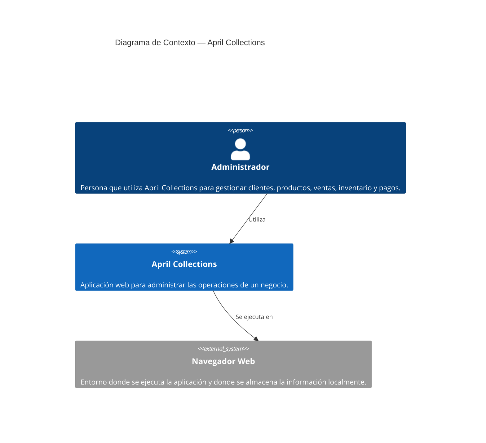
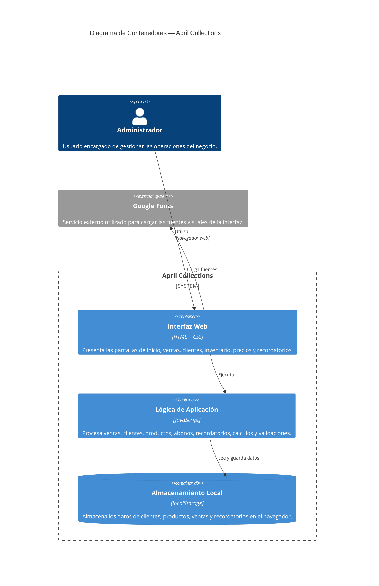

# Práctica 6 — Diagrama C4 de April Collections

## Descripción

April Collections es una aplicación web orientada a la gestión de ventas, clientes,
inventario, precios y recordatorios de pago. El sistema permite registrar clientes,
productos, ventas y abonos, además de consultar información relacionada con las
operaciones del negocio.

La aplicación actualmente funciona como una aplicación web del lado del cliente.
La información se almacena utilizando `localStorage` del navegador.

---

# Nivel 1 — Diagrama de Contexto

## Justificación del nivel 1

El sistema se representa como una aplicación web utilizada principalmente por un
administrador. Se prioriza la **simplicidad** porque April Collections funciona
directamente en el navegador y no requiere actualmente un servidor externo para
su funcionamiento.

También se prioriza la **disponibilidad**, ya que la aplicación puede ejecutarse
desde el navegador sin depender de un servicio backend para las operaciones
básicas. El navegador proporciona el entorno de ejecución y almacenamiento local
necesario para el funcionamiento actual del sistema.

---

# Nivel 2 — Diagrama de Contenedores

## Justificación del nivel 2

La **interfaz web** está separada conceptualmente de la lógica de aplicación para
favorecer la **mantenibilidad**, ya que los elementos visuales pueden modificarse
sin cambiar directamente las reglas que procesan las operaciones.

La lógica está implementada en **JavaScript**, donde se realizan cálculos,
validaciones y operaciones relacionadas con clientes, ventas, inventario y
recordatorios.

El almacenamiento utiliza `localStorage`, decisión que prioriza la
**simplicidad** y permite que el prototipo funcione sin incorporar infraestructura
de servidor. Esta decisión es adecuada para el estado actual del proyecto, aunque
una futura versión podría utilizar una base de datos externa si se requiere
persistencia centralizada o acceso desde diferentes dispositivos.

Google Fonts se representa como sistema externo porque la interfaz utiliza
fuentes cargadas desde un servicio externo.

---

# Correcciones realizadas al borrador generado con IA

Durante la elaboración del diagrama se revisaron las tecnologías propuestas por
la IA para evitar representar componentes que realmente no existen en la
aplicación.

Inicialmente podía ser tentador representar una base de datos como Supabase,
Firebase o un backend independiente. Sin embargo, al revisar el código real de
April Collections se comprobó que actualmente los datos se almacenan mediante
`localStorage`.

Por esta razón, el diagrama fue corregido para representar **localStorage como
el mecanismo de almacenamiento actual** y no como una base de datos externa.

También se evitó agregar APIs, servidores o servicios backend que no forman parte
de la implementación actual.

La aplicación contiene estructuras para clientes, productos, ventas y
recordatorios, y utiliza funciones JavaScript para guardar y recuperar esta
información.

---

# Tecnologías identificadas

| Componente | Tecnología |
|---|---|
| Interfaz | HTML |
| Estilos | CSS |
| Lógica | JavaScript |
| Persistencia actual | localStorage |
| Fuentes externas | Google Fonts |
| Arquitectura actual | Aplicación web del lado del cliente |

---

# Conclusión

Los diagramas C4 muestran que April Collections actualmente tiene una arquitectura
relativamente sencilla, centrada en el navegador. La separación entre interfaz,
lógica y almacenamiento permite comprender mejor las responsabilidades de cada
parte del sistema.

La arquitectura actual favorece principalmente la **simplicidad y mantenibilidad**
del prototipo. Sin embargo, si el sistema evoluciona hacia un uso multiusuario o
requiere acceso a la información desde diferentes dispositivos, sería conveniente
migrar el almacenamiento local hacia una solución centralizada.