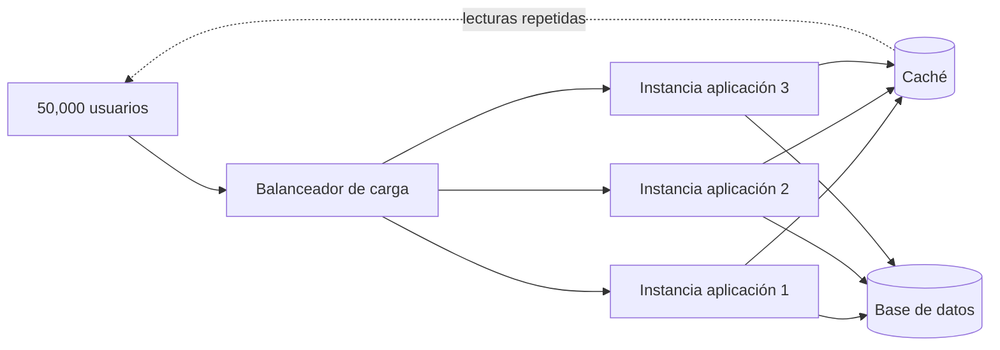

# ADR-001 — Arquitectura para la cooperativa de buses

## Estado

Aceptado

## Contexto

La cooperativa de buses del capstone SE1 ha crecido hasta alcanzar
aproximadamente 50,000 usuarios.

El sistema presenta picos importantes de venta y consulta alrededor de
las 5:00 AM. El principal problema identificado es la capacidad de
responder correctamente ante una gran cantidad de solicitudes concurrentes,
especialmente cuando muchos usuarios realizan consultas repetidas.

El gerente propone utilizar microservicios porque es una arquitectura
actualmente popular. Sin embargo, la decisión arquitectónica debe basarse
en las necesidades reales del sistema y no en la moda tecnológica.

### Atributos de calidad priorizados

1. **Rendimiento:** el sistema debe responder rápidamente durante los picos
   de demanda.

2. **Escalabilidad:** debe ser posible aumentar la capacidad del sistema
   cuando aumente el número de usuarios o solicitudes.

3. **Disponibilidad:** el sistema debe continuar funcionando durante los
   períodos de mayor demanda.

4. **Mantenibilidad:** la arquitectura debe permitir modificar y mantener
   el sistema sin introducir complejidad innecesaria.

5. **Simplicidad operacional:** se busca evitar infraestructura y procesos
   de operación que no sean necesarios para resolver el problema actual.

Los atributos de rendimiento, escalabilidad y disponibilidad tienen la
mayor prioridad debido a los picos de uso. La mantenibilidad y la
simplicidad también son importantes para evitar que la solución sea más
compleja que el problema que pretende resolver.

---

# Opciones consideradas

## Opción 1 — Monolito modular

La aplicación se mantiene como un único sistema desplegable, pero se
organiza internamente mediante módulos con responsabilidades claras.

### Ventajas

- Menor complejidad operacional.
- Más sencillo de desarrollar, probar y desplegar.
- Permite separar módulos sin introducir múltiples servicios.
- Facilita mantener una arquitectura organizada.
- Puede escalarse horizontalmente mediante varias instancias.
- Permite incorporar caché para reducir consultas repetidas.

### Desventajas

- Todo el sistema comparte el mismo despliegue.
- Un cambio puede requerir desplegar la aplicación completa.
- El escalado es menos granular que en una arquitectura de microservicios.
- Un problema grave en la aplicación puede afectar a todo el sistema.

### Evaluación para este caso

Es una opción adecuada porque el principal problema identificado es el
rendimiento durante los picos de demanda y las consultas repetidas, no la
necesidad de separar equipos o desplegar dominios completamente
independientes.

---

# Opción 2 — Microservicios

La aplicación se divide en múltiples servicios independientes, por ejemplo:

- Usuarios
- Ventas
- Búsqueda de viajes
- Pagos
- Notificaciones

Cada servicio podría desplegarse y escalarse de manera independiente.

### Ventajas

- Escalabilidad independiente por servicio.
- Permite desplegar componentes individualmente.
- Aísla parcialmente los problemas entre servicios.
- Puede ser conveniente para organizaciones con equipos grandes y
  autónomos.

### Desventajas

- Mayor complejidad operacional.
- Requiere comunicación entre servicios.
- Puede introducir problemas de red y latencia.
- Requiere monitoreo y administración de múltiples servicios.
- Aumenta la complejidad de pruebas y despliegues.
- Puede ser una solución excesiva para el problema actual.

### Evaluación para este caso

Aunque los microservicios permiten una escalabilidad granular, esa ventaja
no justifica por sí sola la complejidad adicional. El argumento
"microservicios porque es moderno" no constituye una razón arquitectónica
válida.

---

# Opción 3 — Serverless

La aplicación utiliza funciones administradas por un proveedor cloud que
se ejecutan bajo demanda.

### Ventajas

- Escalado automático.
- No requiere administrar directamente servidores.
- Puede ser eficiente para cargas variables.
- Permite pagar principalmente por el uso de las funciones.

### Desventajas

- Dependencia importante del proveedor cloud.
- Puede existir latencia inicial en determinadas funciones.
- El diseño y monitoreo de una arquitectura serverless puede aumentar la
  complejidad.
- Puede producir dependencia de servicios específicos del proveedor.
- No todas las partes de la aplicación se benefician de la misma manera
  de este modelo.

### Evaluación para este caso

Serverless puede resolver parte del problema de escalabilidad, pero
introduce dependencia del proveedor y no es necesario adoptar este modelo
completo para resolver el problema de las consultas repetidas y los picos
de demanda.

---

# Decisión

Se selecciona **monolito modular con caché, balanceo de carga y réplicas**.

La decisión se basa en los atributos de calidad priorizados y en los
problemas reales del sistema.

El monolito modular proporciona una estructura mantenible sin introducir
la complejidad operacional de múltiples servicios.

Para solucionar los picos de demanda se utilizará **balanceo de carga**
para distribuir las solicitudes entre varias instancias de la aplicación.

Se utilizarán **réplicas** para aumentar la capacidad de procesamiento y
mantener la disponibilidad cuando aumente la cantidad de usuarios.

Se utilizará **caché** para almacenar temporalmente información consultada
frecuentemente. Esto permite reducir lecturas repetidas y disminuir la
carga sobre el sistema principal.

La decisión no se basa en que el monolito sea una tecnología "mejor" que
los microservicios o serverless. Se selecciona porque proporciona el mejor
equilibrio entre rendimiento, escalabilidad, disponibilidad, mantenibilidad
y complejidad para este caso concreto.

---

# Diagrama de arquitectura

## Justificación de las palancas de escala

### Caché

La caché reduce las consultas repetidas y evita que información solicitada
frecuentemente tenga que ser obtenida constantemente desde la fuente
principal de datos. Esto mejora principalmente el **rendimiento** durante
los picos de lectura.

### Balanceador de carga

El balanceador distribuye las solicitudes entre las diferentes instancias
de la aplicación. Esto evita concentrar toda la carga en una única instancia
y mejora la **disponibilidad y escalabilidad**.

### Réplicas

Las réplicas permiten ejecutar varias instancias del monolito modular
simultáneamente. Si aumenta la cantidad de usuarios, se pueden agregar
instancias adicionales para aumentar la capacidad de procesamiento.

---

# Consecuencias

## Beneficios aceptados

- Menor complejidad operacional que una arquitectura de microservicios.
- Mejor rendimiento para consultas repetidas mediante caché.
- Capacidad de escalar horizontalmente.
- Mayor disponibilidad mediante múltiples instancias.
- Arquitectura más sencilla de mantener.
- Posibilidad de evolucionar gradualmente hacia una arquitectura más
  distribuida si las necesidades futuras lo justifican.

## Costos y limitaciones aceptadas

- El sistema continúa teniendo un único monolito desplegable.
- El escalado no es tan granular como en microservicios.
- Una modificación puede requerir desplegar nuevamente la aplicación.
- Será necesario administrar la caché y controlar la consistencia de sus
  datos.
- Las réplicas requieren infraestructura adicional.
- Si el crecimiento futuro exige escalado independiente de dominios,
  podría ser necesario evolucionar posteriormente hacia servicios separados.

---

# Trade-off principal

Se acepta sacrificar parte de la granularidad de escalado y la independencia
de despliegue que ofrecen los microservicios a cambio de obtener una
arquitectura significativamente más sencilla de operar y mantener.

La prioridad es resolver el problema real: **50,000 usuarios y picos de
lectura a las 5 AM**.

Por ello, se prioriza:

**monolito modular + caché + balanceo + réplicas**

en lugar de introducir microservicios únicamente porque son una tendencia
tecnológica.

---

# Correcciones al borrador generado con IA

Durante la elaboración de este ADR se utilizó IA como apoyo para generar
un borrador inicial.

El borrador fue revisado para evitar decisiones basadas únicamente en
tendencias tecnológicas.

Se corrigió especialmente la propuesta automática de utilizar
microservicios como solución predeterminada para 50,000 usuarios.

También se evitó asumir que una mayor cantidad de servicios implica
automáticamente mejor rendimiento o escalabilidad.

La decisión final se fundamenta en los atributos de calidad y en los
trade-offs específicos del escenario: rendimiento durante los picos,
escalabilidad horizontal, disponibilidad, mantenibilidad y simplicidad
operacional.

La arquitectura propuesta utiliza únicamente las palancas de escala que
están justificadas por el problema: **caché, balanceo de carga y réplicas**.